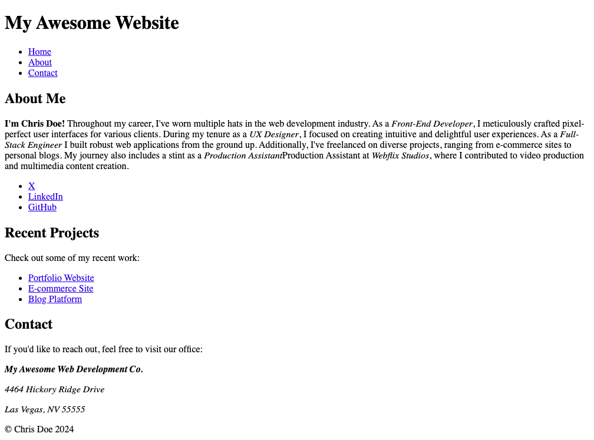

# Semantic HTML Elements Lab 3 - Try it Yourself

## Description 📄
In the final Try It Yourself activity, let's build a user-friendly contact section for Chris Doe's webpage using semantic HTML. Get ready to add addresses, footers, and more!

---

## Developer Objectives 📋

1. **New Section:** New `<section>` for the contacts section
2. **Section description:** Create a paragraph explaining how to reach out (under subheading).
3. **Address Semantic Element:** Use the <address> element to contain the written address.
4. **Footer Semantic Element:** Footer element with copyright info ("© Chris Doe 2024").

---

## ToDo list ✅
**Attention**: When you complete a task, put an `x` in the middle of the brackets to mark it off your ToDo list.

1. [ ] Navigate to the `index.html` file. 
2. [ ] Then navigate to the closing `</main>` tag. 
3. [ ] Below that, create a third `<section>`, put a subheader element with the copy: `Contact`.
4. [ ] Under that, put a paragraph element with the copy: `If you'd like to reach out, feel free to visit our office:`
5. [ ] Now put an `<address>` tag (yes there is one) under that with three paragraph tags:
   1. [ ] The first paragraph tag should be **bold** using the correct semantic element with the copy: `My Awesome Web Development Co.`.
   2. [ ] The second paragraph is normal with the copy: `4464 Hickory Ridge Drive`.
   3. [ ] The third paragraph is normal with the copy: `Las Vegas, NV 55555`.
6. [ ] And finally, below the section you just made, create a `<footer>` element with the copy: `&copy; Chris Doe 2024`.

---

🎊 **AWESOME WORK! You just made your first ever semantic wireframe in HTML! 💃🏻🕺🏾** 🎊

---

### Solution codebase 👀
🛑 **Only use this as a reference** 🛑

💾 **Not something to copy and paste** 💾

**Note:**  This lab references a solution file located [here](https://github.com/HackerUSA-CE/sdai-ic-d3-semantic-html-elements-1/tree/solution) (link not shown).